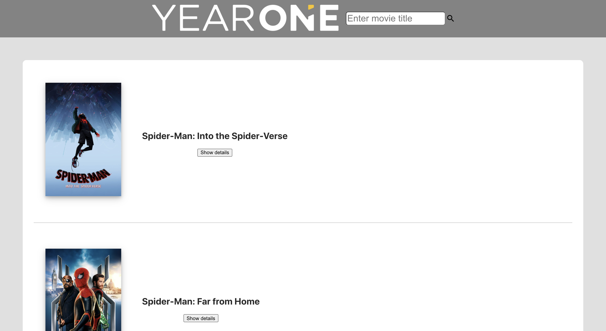
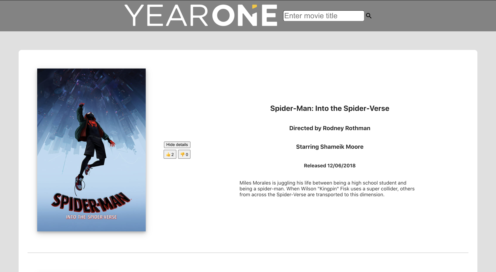

# YearOne Movie Search

### Description

    YearOne's API design challenge.

---

### API Instructions

    We’re building a small web application that allows a user to search for a movie title, click on that movie title for more information, and give that movie a thumbs up or thumbs down.
    Deliverables:
    ● Search functionality that allows a user to enter a title and receive back movie information. (Choose a free API for movie data.
    ● A user should be able to look through title results, if there are more than one, and choose one to read more about. (A good movie to test this with is SpiderMan).
    ● The movie detail page should have the following information at a minimum:
    a. Title
    b. Director
    c. Release Year
    d. Description (if your API provides it)
    e. Ability to thumbs up or thumbs down the movie (see below)
    ● Implement some type of storage or database to persist movie titles and how many thumbs up or thumbs down they’ve received.

### Clone Repository

    https://github.com/Robert-Costello/yearone_movies.git

---

### Run Locally

    npm i
    Installs dependecies

    npm start
    Runs the app in the development mode.

Open [localhost](http://localhost:3000) to view it in the browser.

---

### Run Tests

    npm test
    Launches the test runner in the interactive watch mode.

---

This project leverages [The MovieDB](https://www.themoviedb.org/).

This project was bootstrapped with [Create React App](https://github.com/facebook/create-react-app).
